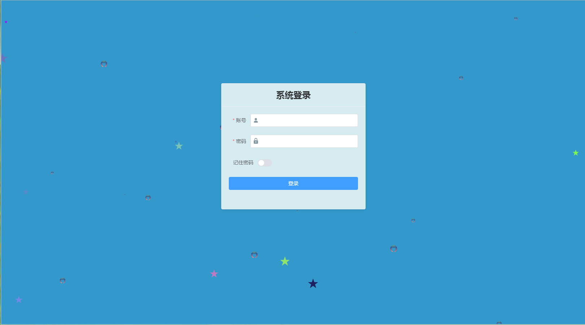
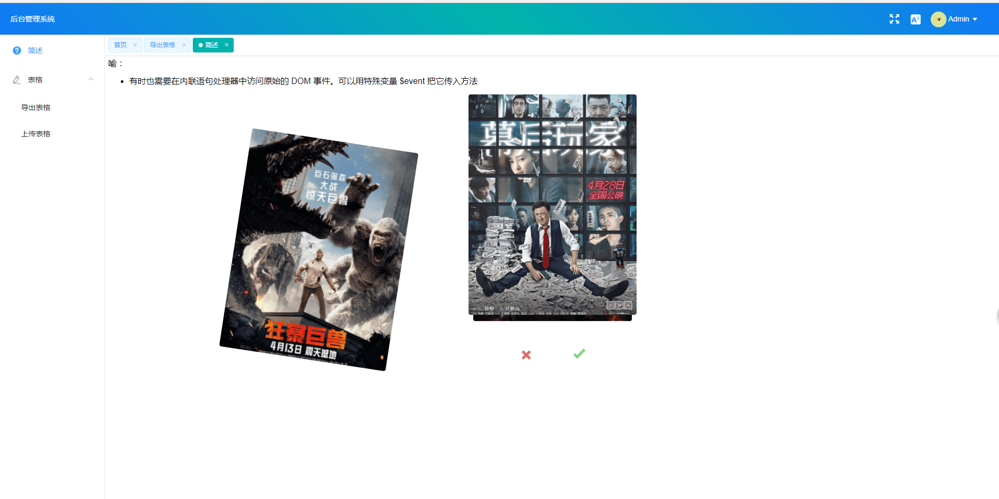
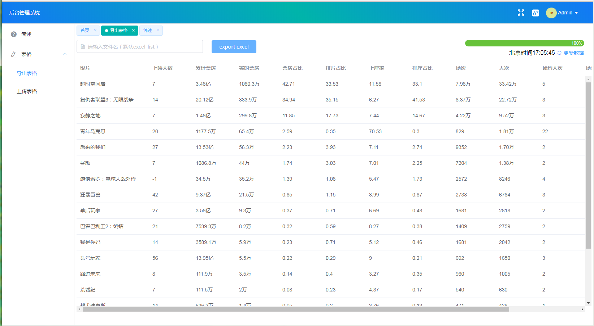
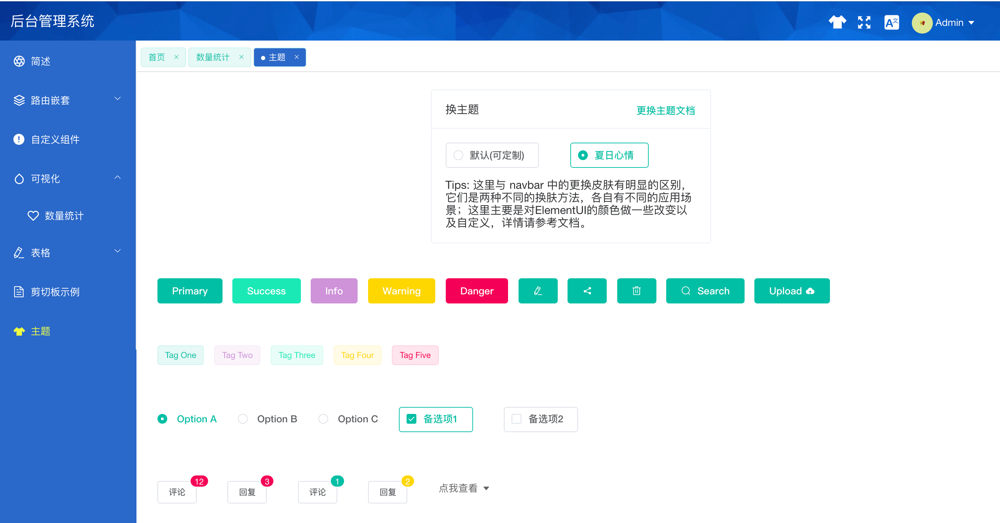

<p align="center"><a href="https://blog.csdn.net/csdn_yudong/article/details/85250412"></a></p>

<p align="center">基于 Vue 和 ElementUI 构建的企业级后台管理项目</p>

<p align="center">
  <a href="https://github.com/vuejs/vue" rel="nofollow" target="_blank">
    
  </a>
  <a href="https://github.com/ElemeFE/element" rel="nofollow" target="_blank">
    
  </a>
  <a href="https://github.com/Neveryu/vue-cms/blob/master/LICENSE">
    
  </a>
  <a href="https://neveryu.github.io/reward/index.html" target="_blank">
    
  </a>
</p>

> 本分支是使用**比较老的** `vue-cli 2.x` 的脚手架来创建的项目，所以目录结构、运行方式、webpack 的配置方式、vue 的配置方式等等都与现在的配置方式有很大的差异。你也可以切换到其它新版本的分支。

## 提示

在使用 npm 包管理工具时，一般我们的 `package.json` 文件中的依赖都没有明确指定版本，可能使用的都是类似 `vuex": "^3.0.1",` 这种前面带 `^` 的版本方式。

`^` 它的意思允许安装该依赖的补丁版本和次要版本，但不允许安装主版本更新。 也就是说在后续的安装依赖的时候，有可能安装到 `vuex@3.0.2` 的版本，也有可能安装到 `vuex@3.2.1` 的版本，但不会安装到 `vuex@4.0.0` 的版本。

但是，你要知道的是： 你使用 `vuex": "^3.0.1",` 这种方式，你当前可能安装下来的是 `vuex@3.0.2` 的版本，并且使用起来很正常。但是过了一段时间或者很长时间以后， `vuex` 在主版本 3 没变的情况下，可能推出了 `3.6.2`、`3.6.5` 的版本，但这个版本可能会引起你的代码报错，也有可能与其他相关依赖之间版本出现不兼容不匹配的情况，也会导致你的代码安装依赖后无法运行。

所以，我的建议是，在你的项目开发稳定以后，或者项目结束以后。锁定你当前使用使用的依赖版本号。不在 `package.json` 中使用类似 `vuex": "^3.0.1",` 这种前面带 `^` 的版本写法，而是具体的 `vuex": "3.0.1",` 的写法。这样，你的代码在后续的使用过程中就不会出现太大的问题。

_如果你的项目在后续的过程中，想升级某个依赖，就针对性的升级某个依赖，如果有问题，就针对性的解决问题就可以了。_

那么，如何查看你的项目当前安装的依赖的准确版本呢？使用如下命令：

```
npm list --depth=0
```

## 预览

在线体验：[https://git.io/fp9UM](https://neveryu.github.io/vue-cms/index.html)

## 简介

`vue-cms` 是一个企业级管理后台项目，基于 `Vue` 和 `ElementUI` 构建。它使用了最新的前端技术栈，内置了 `i18n` 国际化解决方案，支持多语言，路由嵌套，动态路由，权限验证等很多功能特性。

同时，它也提供了首页的数据图表展示，个人中心，主题换肤，表单表格，数据统计等常用的页面模块；
而且拥有完美的 `axios`，`api`，数据存储解决方案以及辅助函数的封装，开箱即用，可以帮助你快速搭建企业后台管理系统。

与此同时，它也是一个很好的学习项目，包含了一些常见问题的解决方案，比如：数据可视化，导入导出功能，自定义组件，自定义指令，富文本；也包含了技术上的一些尝试，比如：基于 `element-ui` 的二次封装，`Decorator` 的使用...

## 写在前面

请确保你安装了 [node](https://nodejs.org/en/) 和 [git](https://git-scm.com/)，与此同时，你应该对 [Vue](https://cn.vuejs.org/v2/guide/)、[Vuex](https://vuex.vuejs.org/zh/)、[Vue Router](https://router.vuejs.org/zh/)、[ES2015+](http://es6.ruanyifeng.com/)、[ElementUI](http://element-cn.eleme.io/#/zh-CN) 有所了解。我们的请求有使用 [Mock.js](https://github.com/nuysoft/Mock/wiki/Getting-Started) 模拟，也有使用线上真实的接口数据，提前了解和学习这些知识会对使用本项目有很大的帮助。

## Build Setup

```bash
# 克隆项目
git clone https://github.com/Neveryu/vue-cms.git

# 进入项目
cd vue-cms

# install dependencies
yarn install --registry https://registry.npm.taobao.org

// or
# 建议不要用 cnpm 安装 会有各种诡异的bug 可以通过如下操作解决 npm 下载速度慢的问题
npm install --registry=https://registry.npm.taobao.org

# serve with hot reload at localhost:8080
npm start
```

浏览器访问 [http://localhost:8080](http://localhost:8080)

## 构建发布

```
# build for production with minification
npm run build

# build for production and view the bundle analyzer report
npm run build --report
```

## 功能

```
- 登录/注销
- 权限验证
- 多环境发布
- 动态侧边栏（支持多级路由）
- better-scroll
- 国际化多语言
- Screenfull全屏
- 列表拖拽
- Svg Sprite 图标
- Dashboard
- 本地mock数据
- Echarts图表
- 导出excel
- 导出zip
- 前端可视化excel
- CountTo
- 自定义组件
- 换肤
- 富文本
```

## 截图






## Online Demo

[在线 Demo](https://neveryu.github.io/vue-cms/index.html)

## Donate

如果你觉得这个项目帮助到了你，你可以帮作者买一杯果汁表示鼓励 :tropical_drink:


## Browsers support

Modern browsers and Internet Explorer 10+.

| [](http://godban.github.io/browsers-support-badges/)</br>IE / Edge | [](http://godban.github.io/browsers-support-badges/)</br>Firefox | [](http://godban.github.io/browsers-support-badges/)</br>Chrome | [](http://godban.github.io/browsers-support-badges/)</br>Safari |
| --------------------------------------------------------------------------------------------------------------------------------------------------------------------------------------------------------------- | ----------------------------------------------------------------------------------------------------------------------------------------------------------------------------------------------------------------- | ------------------------------------------------------------------------------------------------------------------------------------------------------------------------------------------------------------- | ------------------------------------------------------------------------------------------------------------------------------------------------------------------------------------------------------------- |
| IE10, IE11, Edge                                                                                                                                                                                                | last 2 versions                                                                                                                                                                                                   | last 2 versions                                                                                                                                                                                               | last 2 versions                                                                                                                                                                                               |

## License

[MIT](https://github.com/Neveryu/vue-cms/blob/master/LICENSE)

Copyright (c) 2017-present NeverYu
