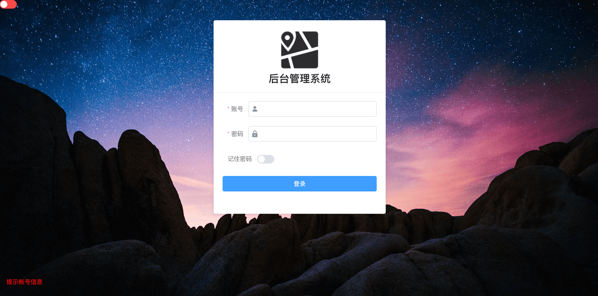

# vue-cms

<p align="center">基于 Vue 和 ElementUI 构建的企业级后台管理项目</p>

<p align="center">
  <a href="https://github.com/vuejs/vue">
    
  </a>
  <a href="https://github.com/ElemeFE/element">
    
  </a>
  <a href="" rel="nofollow">
    
  </a>
  <a href="">
    
  </a>
</p>

## 简介
`vue-cms` 是一个企业级管理后台项目，基于 Vue 和 ElementUI构建。它使用了最新的前端技术栈，内置了i18国际化解决方案，动态路由，权限验证等很多功能特性。

## 写在前面
请确保你安装了 [node](https://nodejs.org/en/) 和 [git](https://git-scm.com/)，与此同时，你应该对 [Vue](https://cn.vuejs.org/v2/guide/)、[ES2015+](http://es6.ruanyifeng.com/)、[ElementUI](http://element-cn.eleme.io/#/zh-CN)有所了解。我们的请求有使用 [Mock.js](https://github.com/nuysoft/Mock/wiki/Getting-Started) 模拟，也有使用线上真实的接口数据，提前了解和学习这些知识会对使用本项目有很大的帮助。

## Build Setup

``` bash
# 克隆项目
git clone https://github.com/Neveryu/vue-cms.git

# install dependencies
npm install

# serve with hot reload at localhost:8080
npm start
```
浏览器访问 [http://localhost:8080](http://localhost:8080)

## 发布

```
# build for production with minification
npm run build

# build for production and view the bundle analyzer report
npm run build --report
```

## 功能
```
- 登录/注销
- 权限验证
- 多环境发布
- 动态侧边栏（支持多级路由）
- better-scroll
- 国际化多语言
- Screenfull全屏
- 列表拖拽
- Svg Sprite 图标
- Dashboard
- 本地mock数据
- Echarts 图表
- 导出excel
- 导出zip
- 前端可视化excel
- CountTo
```

## 截图


